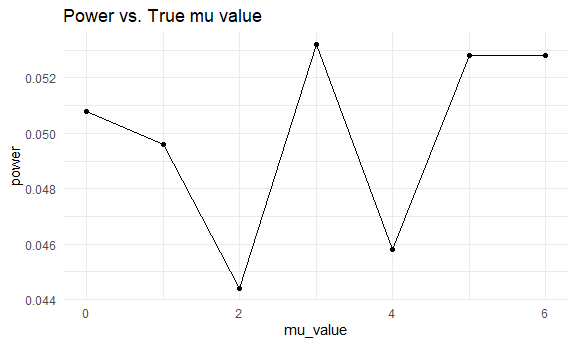
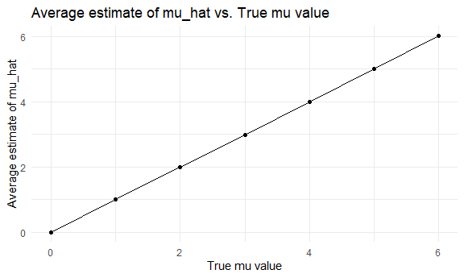
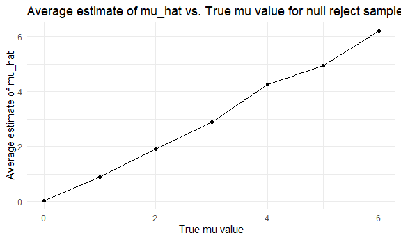

Homework 5
================
Christina Dai

# Problem 2

## Create tidy dataframe

Dataframe including all file names:

``` r
study_df = 
  tibble(
     files = list.files("./data")
  )
```

Iterate over file names and include results in a new variable:

``` r
setwd("~/P8105/p8105_hw5_cd3347/data")
study_df = 
  study_df %>% 
  mutate(
    data = map(files, read_csv)
  )
```

Tidy data:

``` r
study_df_tidy = 
  study_df %>% 
  unnest(data) %>% 
  mutate(files = str_remove(files, ".csv")) %>% 
  separate(col = files, into = c("arm", "id"), sep = "_") %>% 
  pivot_longer(
    week_1:week_8,
    names_to = "week",
    values_to = "value"
  ) %>% 
  mutate(
    week = str_remove(week, "week_")
  ) %>% 
  mutate(
    arm = str_replace(arm, "con", "control"),
    arm = str_replace(arm, "exp", "experiment")
    )
```

Make a spaghetti plot of observations over time:

``` r
study_df_tidy %>% 
  ggplot(aes(x = week, y = value, group = id, color = id)) + 
  geom_line() + 
  facet_grid(. ~ arm)
```


The experiment group and control group start around the same point in
week 1, but the experiment group’s values show an increase over time
while the control group is stagnant.

# Problem 3

Conducting t tests on mu = 0, 1, 2, 3, 4, 5, 6 with fixed n and sigma:

``` r
t_test_all <- function(mu_values = c(0, 1, 2, 3, 4, 5, 6), n = 30, sigma = 5, num_datasets = 5000, alpha = 0.05) {

  results <- map_df(mu_values, function(mu) {
     datasets <- replicate(num_datasets, rnorm(n, mean = mu, sd = sigma), simplify = FALSE)
    map_df(datasets, function(dataset) {
      t_test_result <- t.test(dataset, mu = mu)
      tidy_results <- broom::tidy(t_test_result)
      data.frame(mu = mu, estimate = tidy_results$estimate, p_value = tidy_results$p.value)
    })
  })

  return(results)
}

t_test_all_df = 
  as_tibble(t_test_all()) %>% 
  rename(mu_value = mu)
```

Make a plot showing proportion of times the null was rejected and true
value of mu.

``` r
prop_plot = 
  t_test_all_df %>% 
  mutate(reject = (p_value < 0.05)) %>% 
  group_by(mu_value, reject) %>% 
  summarize(is_true = n()) %>% 
  filter(reject == "TRUE") %>% 
  mutate(power = is_true / 5000) %>% 
  ggplot(aes(x = mu_value, y = power)) + 
  geom_point() + 
  geom_line() + 
  labs(title = "Power vs. True mu value")
```

    ## `summarise()` has grouped output by 'mu_value'. You can override using the
    ## `.groups` argument.

``` r
prop_plot
```



This graph isn’t very clear, but there is an overall increase in power
from when the true mu value is 0 to when it is 6. This is because power
generally increases with effect size.

Plot showing average estimate of mu_hat and true mu value:

``` r
avg_plot = 
  t_test_all_df %>% 
    group_by(mu_value) %>% 
    summarize(avg_mu = mean(estimate)) %>% 
    ggplot(aes(x = mu_value, y = avg_mu)) + 
    geom_line() + 
    geom_point() + 
  labs(title = "Average estimate of mu_hat vs. True mu value",
    x = "True mu value", y = "Average estimate of mu_hat")
           
avg_plot
```



The graph shows a linear relationship between the average estimated mean
and the true mu value.

Plot showing average estimate of mu_hat only in samples for which the
null was rejected and true value of mu:

``` r
avg_plot_reject = 
  t_test_all_df %>% 
    mutate(reject = p_value < 0.05) %>% 
    filter(reject == "TRUE") %>% 
    group_by(mu_value) %>% 
    summarize(avg_mu = mean(estimate)) %>% 
    ggplot(aes(x = mu_value, y = avg_mu)) + 
    geom_line() + 
    geom_point() + 
  labs(title = "Average estimate of mu_hat vs. True mu value for null reject samples",
    x = "True mu value", y = "Average estimate of mu_hat")

avg_plot_reject
```



Yes, the sample average of mu_hat across tests for which the null is
rejected is approximately equal to the true value of mu. This is because
in order for the null to be rejected, the estimate has to be close
enough to the true value of mu to produce a p-value of \< 0.05.
